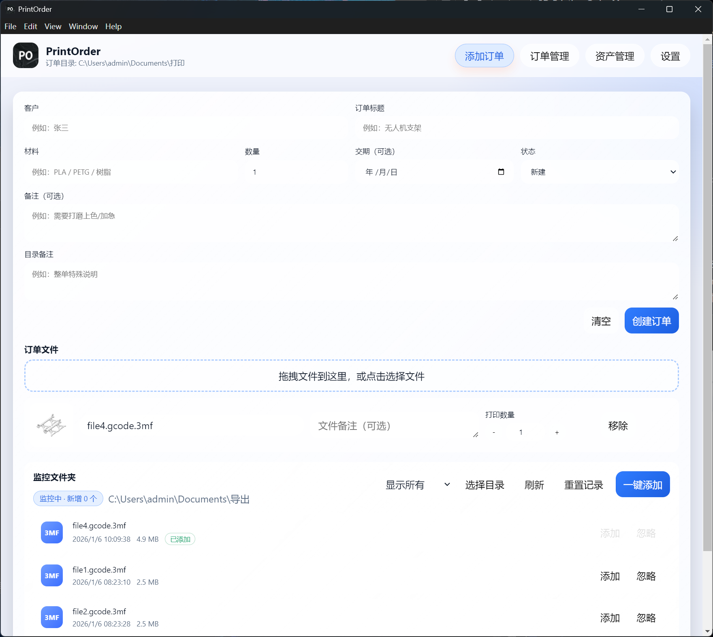
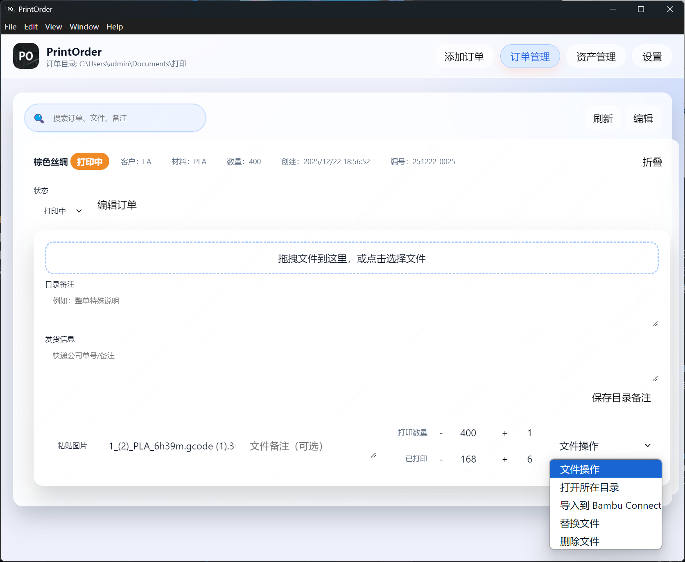

# PrintOrder

面向个人小工作室的本地 3D 打印订单管理工具，支持订单创建、文件管理与打印流程跟踪。数据仅保存在本机文件系统中，离线可用。

## 功能概览

- 订单创建与管理（状态、备注、交期等）
- 订单目录自动命名（含日期与编号）
- 文件拖入/拖出、文件备注、预览图粘贴
- 订单根目录与拖拽模式设置
- 自动监控文件夹功能，支持从文件夹中一键添加最新文件
- 一键导入Bambu connect
- 资产（耗材/客户）管理功能

## 技术栈

- Electron
- 本地文件系统 + JSON 持久化
